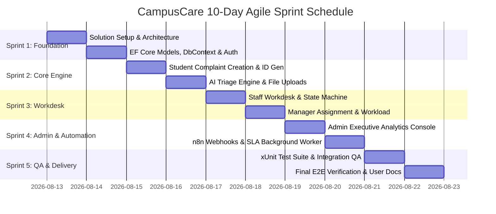

# CampusCare - Agile Sprint Implementation Plan
## Advanced Software Engineering Course Project (10-Day Execution)

---

## 1. Project Team & Agile Ownership Matrix (Team of 7)

The project is developed using **Scrum Methodology** over a **10-day execution lifecycle** divided into **5 2-Day Sprints**.

| Team Member | Primary Scrum Role | Feature Ownership & Modules | Primary Deliverables |
| :--- | :--- | :--- | :--- |
| **Member 1** | **Scrum Master & Lead Architect** | Solution Setup, Architecture, Web API, DI Wiring | `CampusCare.sln`, `Program.cs`, `ComplaintsApiController` |
| **Member 2** | **Full-Stack Developer (Student)** | Student Module, Complaint Engine, Uploads | `StudentController`, `Create.cshtml`, `Details.cshtml` |
| **Member 3** | **Backend Developer (Staff)** | Staff Workdesk, Resolution Workflow, State Machine | `StaffController`, `Details.cshtml`, Workflow Rules |
| **Member 4** | **Full-Stack Developer (Manager & Admin)**| Manager Console, Staff Workload, Admin Analytics | `ManagerController`, `AdminController`, Dashboard Views |
| **Member 5** | **Database & Data Architect** | EF Core DbContext, Entities, Migrations, Seed Data | `ApplicationDbContext`, `DbInitializer`, `schema.sql` |
| **Member 6** | **AI & Automation Specialist** | AI Triage Engine, n8n Webhooks, SLA Background Worker| `AIService`, `NotificationService`, `EscalationBackgroundService` |
| **Member 7** | **QA Lead & UI/UX Engineer** | xUnit Test Suite, Integration QA, Bootstrap 5 Theme | `CampusCare.Tests`, `site.css`, `_Layout.cshtml`, User Docs |

---

## 2. Git Branching & Merge Strategy

```text
main (Production Ready Code Only)
└── develop (Integration & QA Branch)
    ├── feature/auth-setup (Member 1 & 5)
    ├── feature/student-module (Member 2)
    ├── feature/staff-workflow (Member 3)
    ├── feature/manager-admin (Member 4)
    ├── feature/database-seed (Member 5)
    ├── feature/ai-n8n-automation (Member 6)
    └── feature/testing-ui (Member 7)
```

- **Branch Rules**:
  - No direct commits to `main`.
  - Feature branches must have green `dotnet test` runs before merging into `develop`.
  - Pull Requests (PRs) require approval by Lead Architect (Member 1) and QA Lead (Member 7).

---

## 3. Sprint Roadmap (5 Sprints $\times$ 2 Days)



---

## 4. Detailed Sprint Breakdown

### Sprint 1 (Days 1–2): Solution Architecture, Database & ASP.NET Core Identity
- **Goal**: Build modular 3-tier solution, establish database schemas, EF Core migrations, and seed demo accounts.
- **Sprint Backlog Items**:
  - `US-07a`: Initialize .NET solution structure (`Core`, `Infrastructure`, `Web`, `Tests`). [5 Story Points]
  - `US-07b`: Implement EF Core DbContext with shadow properties, foreign key indexes, and constraints. [8 Story Points]
  - `US-01a`: Configure ASP.NET Core Identity & Role Authorization (`Student`, `Staff`, `Manager`, `Admin`). [5 Story Points]
  - `US-07c`: Build `DbInitializer` seeding 7 Departments, 10 Categories, and 6 demo accounts. [5 Story Points]
- **Deliverable**: Solution compiles cleanly; `admin@college.com` can log in; layout header renders role badges.

---

### Sprint 2 (Days 3–4): Student Module & AI Triage Engine
- **Goal**: Allow students to submit complaints, attach files, auto-generate tracking numbers, and view AI recommendations.
- **Sprint Backlog Items**:
  - `US-01`: Build student complaint submission form with file upload support. [8 Story Points]
  - `US-01b`: Implement `GenerateUniqueComplaintNumberAsync` sequence generator (`CMP-2026-00001`). [3 Story Points]
  - `US-09`: Integrate `AIService` with keyword rule-engine fallback (`IT`, `Maintenance`, `Hostel`, `Security`, etc.). [8 Story Points]
  - `US-02`: Build Student Dashboard (`Index.cshtml`) with live status counter cards and tracking table. [5 Story Points]
- **Deliverable**: Student can file complaint; AI assigns suggested category/department; unique ID is assigned.

---

### Sprint 3 (Days 5–6): Staff Workdesk & Manager Assignment Engine
- **Goal**: Implement workflow state validation rules, staff issue processing, manager assignment, and workload tracking.
- **Sprint Backlog Items**:
  - `US-04`: Staff workdesk (`StaffController.Index`) filtering assigned complaints. [5 Story Points]
  - `US-05`: State machine validation (`Submitted` $\rightarrow$ `InProgress` $\rightarrow$ `Resolved` $\rightarrow$ `Closed`) with mandatory resolution notes. [8 Story Points]
  - `US-06`: Manager dashboard (`ManagerController.Index`) with real-time staff workload metrics. [8 Story Points]
  - `US-06b`: Manager staff assignment modal (`Assign.cshtml`) allowing category/priority overrides. [5 Story Points]
- **Deliverable**: Manager assigns complaint to staff member; staff marks complaint `Resolved` with fix details.

---

### Sprint 4 (Days 7–8): Admin Analytics Console, Web API & n8n Automation Worker
- **Goal**: Build executive analytics console, expose Web API endpoints, and set up SLA background escalation worker.
- **Sprint Backlog Items**:
  - `US-08`: Admin executive dashboard (`AdminController.Index`) showing resolution speed in hours and feedback index. [8 Story Points]
  - `US-07d`: Master data management (User status toggles, Department CRUD, Category CRUD). [5 Story Points]
  - `US-10a`: Implement `ComplaintsApiController` exposing JSON endpoints for n8n cron triggers. [5 Story Points]
  - `US-10b`: Implement `EscalationBackgroundService` periodically scanning for overdue complaints (> 48h). [8 Story Points]
- **Deliverable**: Overdue complaints automatically flag `IsEscalated`; Web API returns complaint metrics.

---

### Sprint 5 (Days 9–10): Automated Unit Testing Suite, QA & Documentation
- **Goal**: Complete xUnit test suite, execute end-to-end user flows, and compile complete documentation.
- **Sprint Backlog Items**:
  - `US-QA1`: Write unit tests covering workflow state machine, AI fallback, and unique ID format (`16 Passing Tests`). [8 Story Points]
  - `US-QA2`: Refine dynamic department resolution to ensure zero fallback errors. [5 Story Points]
  - `US-DOC`: Generate 22-section project documentation, ER diagram, database schema SQL, and user manual. [5 Story Points]
- **Deliverable**: `dotnet test` runs with 100% pass rate; project ready for final course demonstration.

---

## 5. Agile Metrics & Story Point Velocity

- **Total Planned Velocity**: 110 Story Points across 5 Sprints.
- **Average Team Velocity**: 22 Story Points / Sprint (approx. 3.1 Points / Student / Day).
- **Definition of Done (DoD)**:
  1. Code written in compliance with C# SOLID guidelines.
  2. Server-side validation and role authorization applied.
  3. `dotnet build` executes with `0 Warning(s), 0 Error(s)`.
  4. Unit tests pass with `dotnet test`.
  5. Feature demonstrated working in browser UI.
