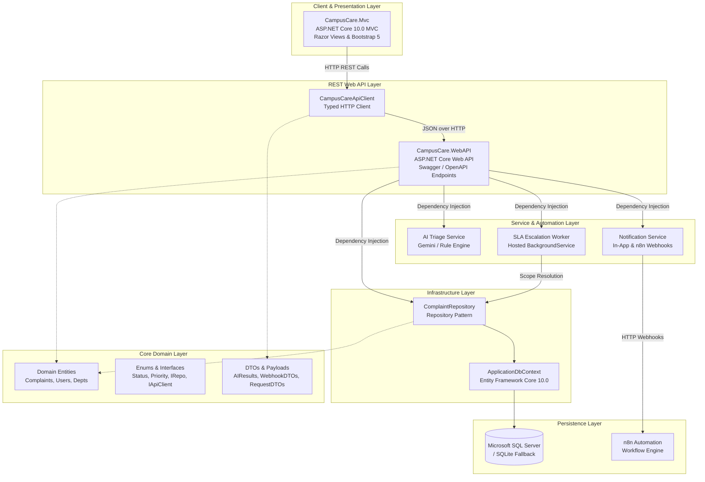
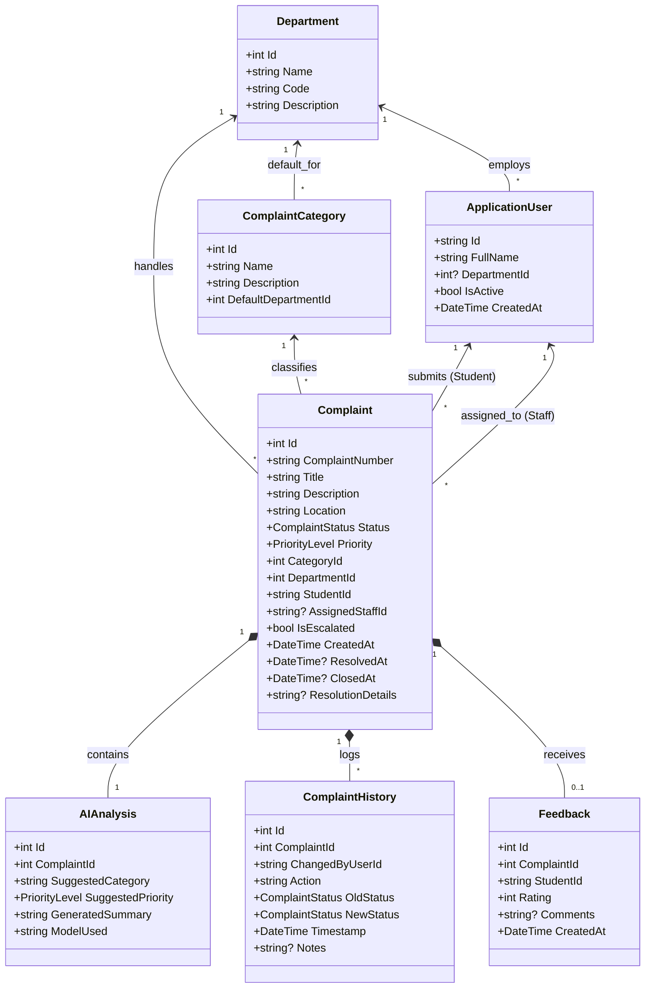
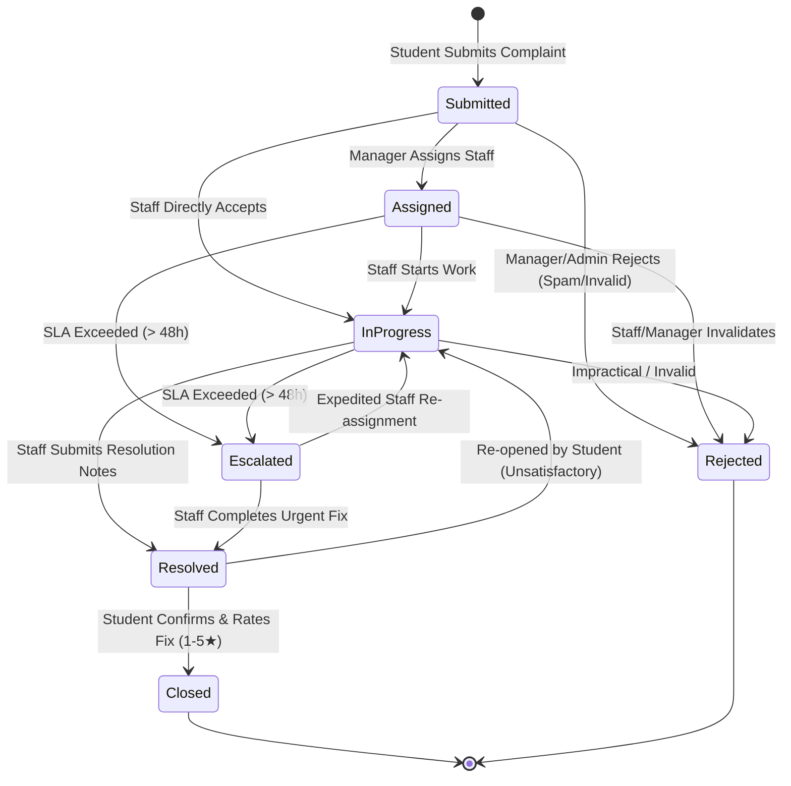
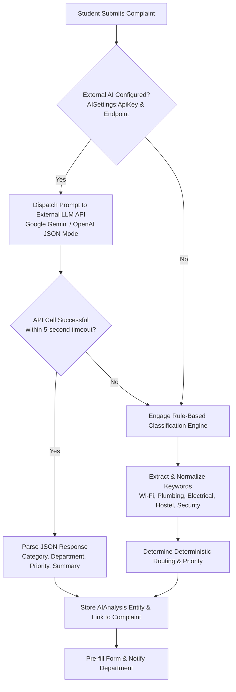

# CampusCare – System Architecture & Technical Design

This document details the software architecture, architectural patterns, design principles, component breakdown, domain model, workflow state machine, and data flow for **CampusCare – Smart College Complaint Management System**.

---

## 1. Architectural Overview

CampusCare is architected around **Clean 3-Tier Architecture** and **Domain-Driven Design (DDD)** principles, separating domain logic, data persistence, and presentation interfaces.

---

## 2. Solution Structure & Module Responsibilities

The Visual Studio / .NET 10 solution (`CampusCare.sln`) is organized into decoupled projects:

| Project | Responsibility | Dependencies | Target Framework |
| :--- | :--- | :--- | :--- |
| **`CampusCare.Core`** | Domain entities, system enums, DTOs, and interface contracts. Contains no external dependencies. | *None* | `.NET 10.0` |
| **`CampusCare.Infrastructure`** | EF Core `ApplicationDbContext`, database repositories, external AI service integrations, SLA background worker, and seed initializer. | `CampusCare.Core`, EF Core, Identity EF Core | `.NET 10.0` |
| **`CampusCare.Mvc`** | User-facing Web application built with ASP.NET Core MVC, Razor views, Bootstrap 5 UI, and cookie authentication. | `CampusCare.Core`, `CampusCare.Infrastructure` | `.NET 10.0` |
| **`CampusCare.WebAPI`** | Standalone RESTful API exposing complaint query, SLA escalation triggers, and n8n webhook callback endpoints with Swagger UI. | `CampusCare.Core`, `CampusCare.Infrastructure`, Swashbuckle | `.NET 10.0` |
| **`CampusCare.Tests`** | Automated unit and integration test suite utilizing xUnit and Moq. | `CampusCare.Core`, `CampusCare.Infrastructure`, `CampusCare.WebAPI`, `Moq`, `xUnit` | `.NET 10.0` |

---

## 3. Core Domain Model & Entity Relationships

The domain model revolves around the `Complaint` aggregate root.

---

## 4. Complaint Workflow & State Machine

Every complaint follows a strictly validated lifecycle state machine. State transitions are verified by business rules to ensure data consistency and full audit trail traceability.

### State Transition Validation Matrix

| From State | Allowed Target States | Permitted Roles | Mandatory Data Required |
| :--- | :--- | :--- | :--- |
| `Submitted` | `Assigned`, `InProgress`, `Rejected` | Manager, Admin, Staff | Assigned Staff ID (for Assign), Rejection Reason (for Reject) |
| `Assigned` | `InProgress`, `Escalated`, `Rejected` | Staff, Manager, System SLA | - |
| `InProgress` | `Resolved`, `Escalated`, `Rejected` | Staff, Manager, System SLA | `ResolutionDetails` (for Resolved) |
| `Escalated` | `InProgress`, `Resolved` | Manager, Staff | Action notes |
| `Resolved` | `Closed`, `InProgress` | Student, Admin | Rating 1–5 (optional for Closed) |
| `Closed` | *Terminal State* | - | Cannot transition out |
| `Rejected` | *Terminal State* | - | Cannot transition out |

---

## 5. AI Triage Engine Architecture

The AI Triage Engine uses a **Dual-Mode Hybrid Strategy** with automated failover:

### Keyword Classification Table (Fallback Engine)

| Keyword Pattern | Inferred Category | Assigned Department | Default Priority |
| :--- | :--- | :--- | :--- |
| `wifi`, `internet`, `network`, `router`, `ethernet` | `IT / Wi-Fi` | `Information Technology` | High (if `exam`/`lab`/`down`), otherwise Medium |
| `pc`, `computer`, `monitor`, `software`, `printer`, `server` | `Laboratory` | `Information Technology` | High |
| `pipe`, `plumb`, `leak`, `tap`, `toilet`, `flush`, `drain` | `Maintenance` | `Facility Maintenance` | High (if `leak`/`overflow`), otherwise Medium |
| `light`, `fan`, `a/c`, `projector`, `bench`, `board`, `desk` | `Classroom` | `Facility Maintenance` | Medium |
| `hostel`, `mess`, `warden`, `bed`, `mattress`, `room allocation`| `Hostel` | `Hostel Administration` | High (if `food`/`water`), otherwise Medium |
| `clean`, `dirt`, `trash`, `sanitation`, `garbage`, `dustbin` | `Cleanliness` | `Facility Maintenance` | Low |
| `fire`, `hazard`, `stolen`, `security`, `theft`, `guard`, `gate` | `Security` | `Campus Security` | Critical (if `theft`/`fire`), otherwise High |
| `bus`, `transport`, `shuttle`, `driver`, `vehicle`, `route` | `Transportation` | `Transport & Fleet` | Medium |
| `library`, `book`, `journal`, `reading room` | `Library` | `Library Services` | Low |
| `fee`, `scholarship`, `certificate`, `office`, `admin` | `Other` | `General Administration` | Medium |

---

## 6. SLA Background Worker & Automation Architecture

1. **`EscalationBackgroundService`**:
   - Implements `Microsoft.Extensions.Hosting.BackgroundService`.
   - Executes an hourly background loop.
   - Instantiates a scoped `IEscalationService`.
   - Identifies active complaints (`Submitted`, `Assigned`, `InProgress`) created $\ge 48$ hours ago that are not yet marked `IsEscalated`.
   - Flags records, updates status to `Escalated`, logs history audit events, and dispatches webhook notifications.

2. **Web API SLA Endpoint**:
   - Web API exposes `POST /api/complaints/escalate-overdue?overdueHours=48`.
   - Allows external workflow engines (such as **n8n**, GitHub Actions, or Windows Task Scheduler) to trigger SLA verification on-demand or on cron schedules.

---

## 7. Security & Authentication Architecture

- **ASP.NET Core Identity**: Manages credential storage, SHA-256 password hashing with salt, password policies, and role management.
- **Role-Based Access Control (RBAC)**:
  - `[Authorize(Roles = "Student")]`: File complaints, view own history, add comments, submit feedback.
  - `[Authorize(Roles = "Staff")]`: Access department workdesk, change complaint statuses, add technical resolution notes.
  - `[Authorize(Roles = "Manager")]`: View department overview, inspect staff workload counters, assign complaints to specific staff.
  - `[Authorize(Roles = "Admin")]`: Full administrative privileges, user management (activate/deactivate), department/category master data, bulk purging.
- **Cross-Site Request Forgery (CSRF)**: Anti-forgery tokens validated on all MVC POST forms (`@Html.AntiForgeryToken()`).
- **Cross-Origin Resource Sharing (CORS)**: Configured in `CampusCare.WebAPI` with explicit allowed policies for external dashboards and integrations.
