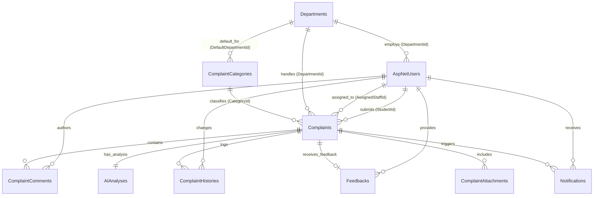

# CampusCare Database Schema Documentation

This document provides the complete database schema specification, table relationships, data dictionary, SQL DDL scripts, and indexing strategy for the **CampusCare – Smart College Complaint Management System**.

The database architecture is designed with **Microsoft SQL Server / LocalDB** (with automatic SQLite compatibility), utilizing **Entity Framework Core Code-First** models.

---

## 1. Entity-Relationship Diagram (ERD)

---

## 2. Data Dictionary & Table Specifications

### 2.1 `AspNetUsers` (Extended Identity User)
Stores system users across all 4 roles (`Student`, `Staff`, `Manager`, `Admin`).

| Column Name | Data Type | Nullable | Key / Constraint | Description |
| :--- | :--- | :--- | :--- | :--- |
| `Id` | `NVARCHAR(450)` | No | PK | ASP.NET Core Identity User Unique ID (GUID) |
| `UserName` | `NVARCHAR(256)` | Yes | Unique Index | Login username (email address) |
| `Email` | `NVARCHAR(256)` | Yes | Unique Index | User email address |
| `FullName` | `NVARCHAR(100)` | No | - | User's full display name |
| `DepartmentId` | `INT` | Yes | FK $\rightarrow$ `Departments(Id)` | Assigned department (Null for Students) |
| `CreatedAt` | `DATETIME2` | No | Default `GETUTCDATE()` | Account registration timestamp |
| `IsActive` | `BIT` | No | Default `1` | Account status flag (1=Active, 0=Deactivated) |

---

### 2.2 `Departments`
Stores academic and operational college departments responsible for handling complaints.

| Column Name | Data Type | Nullable | Key / Constraint | Description |
| :--- | :--- | :--- | :--- | :--- |
| `Id` | `INT` | No | PK, Identity(1,1) | Department Primary Key |
| `Name` | `NVARCHAR(100)` | No | Required | Full department name (e.g. Information Technology) |
| `Code` | `NVARCHAR(10)` | No | Unique Index | Short department code (e.g. IT, MAINT, HOSTEL) |
| `Description` | `NVARCHAR(300)` | Yes | - | Scope description of department responsibilities |

---

### 2.3 `ComplaintCategories`
Stores complaint categories and maps them to default responsible departments.

| Column Name | Data Type | Nullable | Key / Constraint | Description |
| :--- | :--- | :--- | :--- | :--- |
| `Id` | `INT` | No | PK, Identity(1,1) | Category Primary Key |
| `Name` | `NVARCHAR(100)` | No | Required | Category name (e.g. IT / Wi-Fi, Maintenance) |
| `Description` | `NVARCHAR(300)` | Yes | - | Description of issues under this category |
| `DefaultDepartmentId` | `INT` | No | FK $\rightarrow$ `Departments(Id)` | Default department for issue routing |

---

### 2.4 `Complaints` (Core Aggregate Root)
Stores all college complaints, their lifecycle state, location, and assignment.

| Column Name | Data Type | Nullable | Key / Constraint | Description |
| :--- | :--- | :--- | :--- | :--- |
| `Id` | `INT` | No | PK, Identity(1,1) | Complaint Primary Key |
| `ComplaintNumber` | `NVARCHAR(20)` | No | Unique Index | Generated tracking number (`CMP-YYYY-00001`) |
| `Title` | `NVARCHAR(150)` | No | Required | Short summary title of issue |
| `Description` | `NVARCHAR(2000)`| No | Required | Full detailed description of the problem |
| `Location` | `NVARCHAR(100)` | No | Required | Room, block, or building location |
| `Status` | `INT` | No | Enum | State: 1=Submitted, 2=Assigned, 3=InProgress, 4=Escalated, 5=Resolved, 6=Closed, 7=Rejected |
| `Priority` | `INT` | No | Enum | Priority: 1=Low, 2=Medium, 3=High, 4=Critical |
| `CategoryId` | `INT` | No | FK $\rightarrow$ `ComplaintCategories(Id)` | Associated issue category |
| `DepartmentId` | `INT` | No | FK $\rightarrow$ `Departments(Id)` | Responsible department handling the issue |
| `StudentId` | `NVARCHAR(450)` | No | FK $\rightarrow$ `AspNetUsers(Id)` | Student who filed the complaint |
| `AssignedStaffId` | `NVARCHAR(450)` | Yes | FK $\rightarrow$ `AspNetUsers(Id)` | Staff member assigned to resolve the issue |
| `CreatedAt` | `DATETIME2` | No | Default `GETUTCDATE()` | Submission timestamp |
| `UpdatedAt` | `DATETIME2` | Yes | - | Timestamp of last status change or edit |
| `ResolvedAt` | `DATETIME2` | Yes | - | Timestamp when status changed to Resolved |
| `ClosedAt` | `DATETIME2` | Yes | - | Timestamp when student/system closed complaint |
| `IsEscalated` | `BIT` | No | Default `0` | SLA breach flag (1=Escalated after 48h) |
| `EscalatedAt` | `DATETIME2` | Yes | - | Timestamp when SLA escalation occurred |
| `EscalationReason` | `NVARCHAR(300)` | Yes | - | Reason logged for escalation |
| `ResolutionDetails` | `NVARCHAR(2000)`| Yes | - | Technical/physical fix notes logged by staff |

---

### 2.5 `AIAnalyses`
Stores AI triage output (category, priority, department, summary) for each complaint.

| Column Name | Data Type | Nullable | Key / Constraint | Description |
| :--- | :--- | :--- | :--- | :--- |
| `Id` | `INT` | No | PK, Identity(1,1) | AI Analysis Primary Key |
| `ComplaintId` | `INT` | No | FK $\rightarrow$ `Complaints(Id)`, Unique | One-to-One FK link to Complaint |
| `SuggestedCategory` | `NVARCHAR(100)` | No | - | AI recommended category string |
| `SuggestedPriority` | `INT` | No | Enum | AI recommended priority level |
| `SuggestedDepartment`| `NVARCHAR(100)` | No | - | AI recommended department name |
| `GeneratedSummary` | `NVARCHAR(300)` | No | - | Concise AI generated summary sentence |
| `AnalyzedAt` | `DATETIME2` | No | Default `GETUTCDATE()` | AI execution timestamp |
| `ModelUsed` | `NVARCHAR(100)` | No | - | AI Model Name (e.g. Gemini-Pro, RuleEngine-v1) |
| `ConfidenceScore` | `FLOAT` | No | Default `0.85` | Confidence metric (0.0 to 1.0) |

---

### 2.6 `Feedbacks`
Stores post-resolution student ratings and reviews.

| Column Name | Data Type | Nullable | Key / Constraint | Description |
| :--- | :--- | :--- | :--- | :--- |
| `Id` | `INT` | No | PK, Identity(1,1) | Feedback Primary Key |
| `ComplaintId` | `INT` | No | FK $\rightarrow$ `Complaints(Id)`, Unique | One-to-One link to Complaint |
| `StudentId` | `NVARCHAR(450)` | No | FK $\rightarrow$ `AspNetUsers(Id)` | Student submitting feedback |
| `Rating` | `INT` | No | Check (1-5) | Star rating score (1 to 5) |
| `Comment` | `NVARCHAR(500)` | Yes | - | Optional student review text |
| `SubmittedAt` | `DATETIME2` | No | Default `GETUTCDATE()` | Feedback submission timestamp |

---

### 2.7 `ComplaintHistories`
Immutable audit log tracking all status changes, assignments, and system events.

| Column Name | Data Type | Nullable | Key / Constraint | Description |
| :--- | :--- | :--- | :--- | :--- |
| `Id` | `INT` | No | PK, Identity(1,1) | History Primary Key |
| `ComplaintId` | `INT` | No | FK $\rightarrow$ `Complaints(Id)` | Parent complaint ID |
| `ChangedByUserId` | `NVARCHAR(450)` | No | FK $\rightarrow$ `AspNetUsers(Id)` | User or System ID performing action |
| `Action` | `NVARCHAR(100)` | No | Required | Description of action (e.g. Status Updated to InProgress) |
| `OldStatus` | `INT` | Yes | Enum | Previous status |
| `NewStatus` | `INT` | No | Enum | New updated status |
| `Timestamp` | `DATETIME2` | No | Default `GETUTCDATE()` | Action execution timestamp |
| `Notes` | `NVARCHAR(1000)` | Yes | - | Additional notes or directives |

---

### 2.8 `ComplaintComments`
Stores discussion messages and internal staff notes on complaints.

| Column Name | Data Type | Nullable | Key / Constraint | Description |
| :--- | :--- | :--- | :--- | :--- |
| `Id` | `INT` | No | PK, Identity(1,1) | Comment Primary Key |
| `ComplaintId` | `INT` | No | FK $\rightarrow$ `Complaints(Id)` | Parent complaint ID |
| `UserId` | `NVARCHAR(450)` | No | FK $\rightarrow$ `AspNetUsers(Id)` | Comment author ID |
| `CommentText` | `NVARCHAR(1000)` | No | Required | Message text |
| `CreatedAt` | `DATETIME2` | No | Default `GETUTCDATE()` | Message creation timestamp |
| `IsInternalOnly` | `BIT` | No | Default `0` | Flag (1=Internal staff note hidden from student, 0=Public) |

---

### 2.9 `ComplaintAttachments`
Stores photo and document file attachments uploaded by students.

| Column Name | Data Type | Nullable | Key / Constraint | Description |
| :--- | :--- | :--- | :--- | :--- |
| `Id` | `INT` | No | PK, Identity(1,1) | Attachment Primary Key |
| `ComplaintId` | `INT` | No | FK $\rightarrow$ `Complaints(Id)` | Parent complaint ID |
| `FileName` | `NVARCHAR(255)` | No | Required | Original filename |
| `FilePath` | `NVARCHAR(500)` | No | Required | Server relative file path (`/uploads/guid_file.jpg`) |
| `ContentType` | `NVARCHAR(100)` | No | Required | MIME Type (e.g. image/png, application/pdf) |
| `FileSize` | `BIGINT` | No | Required | File size in bytes |
| `UploadedAt` | `DATETIME2` | No | Default `GETUTCDATE()` | Upload timestamp |

---

### 2.10 `Notifications`
Stores in-app user notifications.

| Column Name | Data Type | Nullable | Key / Constraint | Description |
| :--- | :--- | :--- | :--- | :--- |
| `Id` | `INT` | No | PK, Identity(1,1) | Notification Primary Key |
| `UserId` | `NVARCHAR(450)` | No | FK $\rightarrow$ `AspNetUsers(Id)` | Target user ID |
| `Title` | `NVARCHAR(150)` | No | Required | Notification title |
| `Message` | `NVARCHAR(500)` | No | Required | Alert text message |
| `IsRead` | `BIT` | No | Default `0` | Read flag (0=Unread, 1=Read) |
| `CreatedAt` | `DATETIME2` | No | Default `GETUTCDATE()` | Timestamp |
| `RelatedComplaintId`| `INT` | Yes | FK $\rightarrow$ `Complaints(Id)` | Linked complaint ID |

---

## 3. Indexing & Foreign Key Delete Behaviors

1. **Unique Indexes**:
   - `Complaints.ComplaintNumber` (Unique Index for fast tracking lookups).
   - `Departments.Code` (Unique Index).
   - `AIAnalyses.ComplaintId` (Unique Index for 1-to-1 relationship).
   - `Feedbacks.ComplaintId` (Unique Index for 1-to-1 relationship).

2. **Foreign Key Cascade Rules**:
   - `Complaint` $\rightarrow$ `Student` (`DeleteBehavior.Restrict` - Prevents deleting user with active complaints).
   - `Complaint` $\rightarrow$ `AssignedStaff` (`DeleteBehavior.Restrict`).
   - `Complaint` $\rightarrow$ `Department` (`DeleteBehavior.Restrict`).
   - `Complaint` $\rightarrow$ `Category` (`DeleteBehavior.Restrict`).
   - `Complaint` $\rightarrow$ `Feedback` (`DeleteBehavior.Cascade`).
   - `Complaint` $\rightarrow$ `AIAnalysis` (`DeleteBehavior.Cascade`).
   - `Complaint` $\rightarrow$ `ComplaintComments` (`DeleteBehavior.Cascade`).
   - `Complaint` $\rightarrow$ `ComplaintHistory` (`DeleteBehavior.Cascade`).
