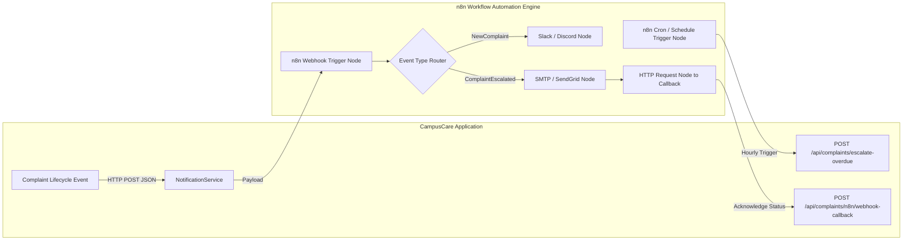
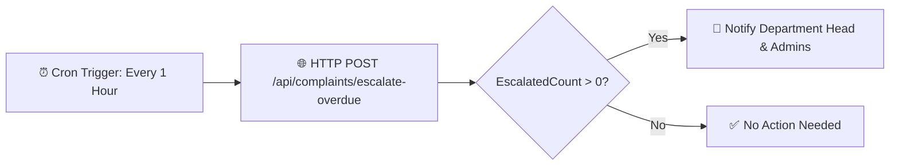

# CampusCare – n8n Workflow Automation & Webhooks Guide

This document describes how to integrate **CampusCare** with **n8n** (an extensible, open-source workflow automation tool) to achieve automated SLA monitoring, multi-channel notifications (Email, Slack, Discord, SMS), and bi-directional webhook callbacks.

---

## 1. Automation Architecture



---

## 2. Supported Event Webhook Payloads

When actions occur in CampusCare, `NotificationService` formats a `NotificationPayload` JSON object and sends an HTTP POST request to the configured n8n webhook URL.

### Webhook JSON Payload Schema

```json
{
  "eventType": "NewComplaint",
  "complaintId": 101,
  "complaintNumber": "CMP-2026-00101",
  "title": "Main Water Line Burst in Academic Block C",
  "status": "Submitted",
  "priority": "High",
  "department": "Facility Maintenance",
  "studentEmail": "student1@college.com",
  "staffEmail": "staff2@college.com",
  "timestamp": "2026-08-24T12:00:00Z"
}
```

### Event Types Catalog

| Event Name | Trigger Condition | Recommended n8n Action |
| :--- | :--- | :--- |
| **`NewComplaint`** | Student submits a new complaint | Post alert to departmental Slack/Discord channel |
| **`ComplaintResolved`** | Staff logs fix notes and marks ticket `Resolved` | Send email or SMS to student asking for feedback |
| **`ComplaintEscalated`** | SLA worker identifies ticket unresolved after 48h | Dispatch high-priority alert to Department Manager |

---

## 3. Step-by-Step Workflow Setup in n8n

### Scenario 1: Hourly SLA Breach Escalation Trigger

This workflow executes an automated cron job every 60 minutes, invoking the CampusCare Web API to identify and escalate overdue complaints.

1. **Add Schedule Trigger Node**:
   - Interval: **Every 1 Hour**.
2. **Add HTTP Request Node**:
   - **Method**: `POST`
   - **URL**: `http://localhost:5001/api/complaints/escalate-overdue?overdueHours=48`
   - **Authentication**: None / Header Token (if configured)
3. **Add IF Condition Node**:
   - Condition: `{{ $json.escalatedCount }} > 0`
4. **Add Slack / Discord / Email Notification Node**:
   - Send message: `🚨 SLA Alert: {{ $json.escalatedCount }} complaints breached the 48-hour resolution window and were escalated!`



---

### Scenario 2: New Complaint Dispatch to Discord / Slack

1. **Add Webhook Node**:
   - **HTTP Method**: `POST`
   - **Path**: `campuscare-new-complaint`
   - Copy the generated Webhook URL (e.g. `http://localhost:5678/webhook/campuscare-new-complaint`).
2. **Configure CampusCare `appsettings.json`**:
   ```json
   "n8nSettings": {
     "NewComplaintWebhookUrl": "http://localhost:5678/webhook/campuscare-new-complaint"
   }
   ```
3. **Add Discord / Slack Node in n8n**:
   - Format message template:
     ```text
     📌 New Complaint Filed: {{ $json.body.complaintNumber }}
     Title: {{ $json.body.title }}
     Department: {{ $json.body.department }}
     Priority: {{ $json.body.priority }}
     Submitted By: {{ $json.body.studentEmail }}
     ```

---

### Scenario 3: Bi-Directional Callback Notification

When an external notification (e.g., WhatsApp message or SMS) is delivered via an external provider in n8n:
1. Add an **HTTP Request Node** at the end of the n8n flow.
2. **Method**: `POST`
3. **URL**: `http://localhost:5001/api/complaints/n8n/webhook-callback`
4. **Body**:
   ```json
   {
     "event": "NotificationDelivered",
     "complaintId": {{ $json.body.complaintId }},
     "gateway": "TwilioWhatsApp",
     "deliveryStatus": "Success"
   }
   ```
5. CampusCare logs the acknowledgment and returns `{ "status": "Acknowledged" }`.

---

## 4. Sample n8n Workflow JSON Export

You can import this sample workflow directly into n8n via **Workflow $\rightarrow$ Import from JSON**:

```json
{
  "name": "CampusCare SLA Automation & Notification Workflow",
  "nodes": [
    {
      "parameters": {
        "rule": {
          "interval": [
            {
              "field": "hours",
              "hoursInterval": 1
            }
          ]
        }
      },
      "id": "1",
      "name": "Hourly Schedule Trigger",
      "type": "n8n-nodes-base.scheduleTrigger",
      "typeVersion": 1.1,
      "position": [250, 300]
    },
    {
      "parameters": {
        "method": "POST",
        "url": "http://localhost:5001/api/complaints/escalate-overdue?overdueHours=48",
        "options": {}
      },
      "id": "2",
      "name": "Trigger SLA Escalation API",
      "type": "n8n-nodes-base.httpRequest",
      "typeVersion": 4.1,
      "position": [480, 300]
    }
  ],
  "connections": {
    "Hourly Schedule Trigger": {
      "main": [
        [
          {
            "node": "Trigger SLA Escalation API",
            "type": "main",
            "index": 0
          }
        ]
      ]
    }
  }
}
```
