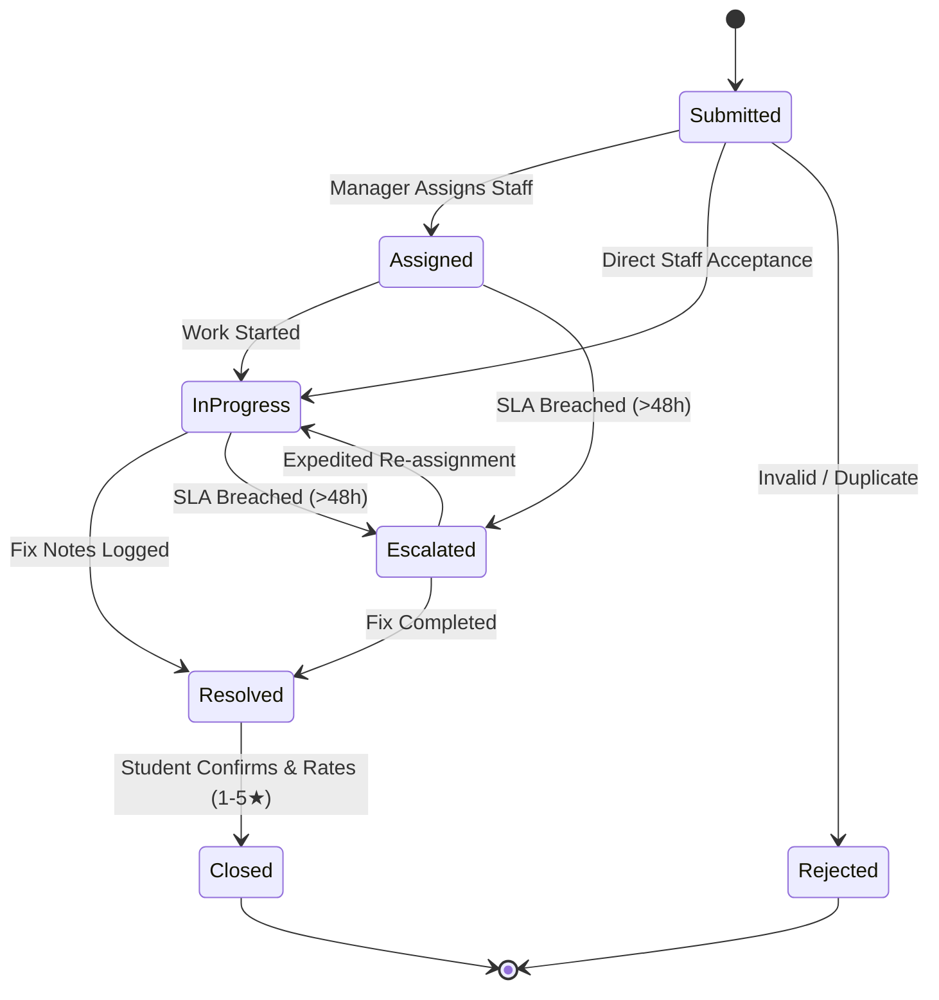
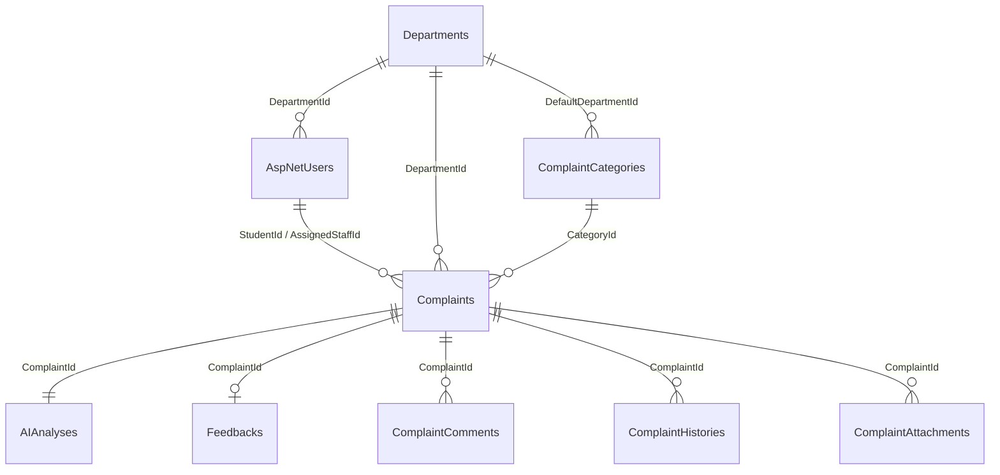

# CampusCare – Comprehensive Project & Technical Report

**Project Title**: CampusCare – Smart College Complaint Management System  
**Academic / Enterprise Project Documentation**  
**Technology Stack**: C# 13, ASP.NET Core 10.0 MVC, ASP.NET Core Web API, Entity Framework Core 10.0, SQL Server / SQLite, xUnit, AI Triage Engine, n8n Automation.

---

## 1. Executive Summary

Traditional complaint management systems in universities and academic institutions suffer from paper-bound friction, fragmented communication, lack of automated prioritization, and missing audit trails. Complaints submitted by students frequently experience unresolved bottlenecks, lack transparency, and breach institutional Service Level Agreements (SLAs).

**CampusCare** is an enterprise-style, automated campus grievance management system engineered with **ASP.NET Core 10.0** and **Entity Framework Core**. It features a clean 3-tier architecture with multi-role access control (`Student`, `Staff`, `Manager`, `Admin`), an intelligent **AI Triage Classification Engine** that automatically categorizes issues, a background **SLA Escalation Worker Service**, a standalone **RESTful Web API** with Swagger documentation, and **n8n automation webhooks**.

---

## 2. Problem Statement & Project Objectives

### 2.1 Problem Statement
- **Lack of Centralized Tracking**: Issues reported across college departments (IT, Maintenance, Hostel, Security, Transport) are tracked in disconnected spreadsheets or paper registers.
- **Manual Routing Delays**: Complaints sit unassigned because there is no automated triage or intelligent departmental routing mechanism.
- **SLA Non-Compliance**: Urgent grievances (e.g. electrical hazards, network outages during examinations) frequently exceed resolution deadlines without alerting supervisors.
- **Missing Student Feedback Loop**: Students are left in the dark about resolution progress and have no structured way to rate or confirm fixes.

### 2.2 Project Objectives
1. **Develop a Multi-Tenant Role-Based Portal**: Provide dedicated interfaces for Students, Technicians, Department Managers, and Administrators.
2. **Implement Intelligent AI Triage**: Automatically analyze complaint text to infer category, department, and priority with fail-safe local rule engines.
3. **Automate SLA Enforcement**: Run continuous background health checks that automatically flag and escalate overdue tickets ($\ge 48$ hours).
4. **Deliver a Dual Interface**: Combine rich Razor MVC server-rendered dashboards with a decoupled REST API for mobile apps and external automations.
5. **Ensure Robust Quality**: Validate domain rules, ID generation, state machine transitions, and API endpoints with comprehensive automated test suites.

---

## 3. Requirements Analysis

### 3.1 Functional Requirements (FRs)
- **FR-01 (Authentication & Authorization)**: Multi-role authentication with secure password hashing and role-based route protection.
- **FR-02 (Complaint Submission & Unique Tracking ID)**: Allow students to file complaints with location, description, and file attachments, generating atomic IDs (`CMP-YYYY-00001`).
- **FR-03 (AI Triage & Auto-Routing)**: Categorize complaint text using Gemini/LLM APIs with instant fallback to a keyword rule engine.
- **FR-04 (Staff Workdesk & Resolution Lifecycle)**: Enable staff to filter their queue, update progress, and log mandatory resolution notes.
- **FR-05 (Manager Assignment & Workload Tracking)**: Provide managers with visibility over unassigned tickets and technician workloads.
- **FR-06 (SLA Escalation Worker)**: Background service automatically flagging tickets unresolved after 48 hours.
- **FR-07 (Student Satisfaction & Rating)**: 1 to 5 star rating mechanism and post-resolution confirmation.
- **FR-08 (Admin Executive Analytics & Maintenance)**: KPI summary cards, user activation/deactivation, and bulk retention purge.
- **FR-09 (RESTful Web API & Swagger)**: Complete API endpoints for querying complaints, triggering SLA scans, and receiving webhook callbacks.

### 3.2 Non-Functional Requirements (NFRs)
- **NFR-01 (Performance)**: Sub-200ms page load times and sub-50ms REST API response times for indexed queries.
- **NFR-02 (Reliability & Fault Tolerance)**: Automatic database fallback (SQL Server $\rightarrow$ SQLite) and automated AI fallback ensuring zero submission failures.
- **NFR-03 (Maintainability & Clean Architecture)**: Decoupled solution layers (`Core`, `Infrastructure`, `Mvc`, `WebAPI`, `Tests`).
- **NFR-04 (Security)**: Protection against CSRF, SQL Injection (parameterized EF queries), XSS, and unauthorized role escalation.

---

## 4. System Architecture & Detailed Design

### 4.1 3-Tier Layered Architecture
CampusCare strictly follows Clean Architecture:
- **Presentation Layer**:
  - `CampusCare.Mvc`: Server-rendered Razor views with responsive Bootstrap 5 theme and custom CSS.
  - `CampusCare.WebAPI`: Controller-based Web API with OpenAPI / Swagger UI.
- **Business & Infrastructure Layer**:
  - `CampusCare.Infrastructure`: Implements `IComplaintRepository`, `IAIService`, `INotificationService`, `IEscalationService`, and `EscalationBackgroundService`.
- **Domain Core Layer**:
  - `CampusCare.Core`: POCO domain entities (`Complaint`, `Department`, `ApplicationUser`, `AIAnalysis`, `ComplaintHistory`, `Feedback`), enums, and interfaces.

### 4.2 State Machine & Workflow Transitions


---

## 5. Database Schema & Data Dictionary Summary

The database is powered by Entity Framework Core with full support for Microsoft SQL Server, LocalDB, and SQLite.



### Key Tables Overview:
1. `AspNetUsers`: Identity users with role claims and department affiliations.
2. `Departments`: 7 campus operational departments (`IT`, `MAINT`, `HOSTEL`, `LIB`, `SEC`, `TRANS`, `ADMIN`).
3. `ComplaintCategories`: 10 pre-seeded grievance categories.
4. `Complaints`: Core aggregate root containing metadata, tracking ID, timestamps, and resolution notes.
5. `AIAnalyses`: Records AI-suggested categories, priority levels, and generated summaries.
6. `ComplaintHistories`: Immutable audit trail of every status transition and action.
7. `Feedbacks`: Student satisfaction ratings (1–5 stars) and qualitative feedback.

---

## 6. Implementation Highlights

### 6.1 Intelligent AI Triage Engine (`AIService.cs`)
```csharp
// Dual-mode AI execution: attempts LLM integration with 5s timeout, falls back to deterministic rule engine
public async Task<AIAnalysisResult> AnalyzeComplaintAsync(string title, string description, string location)
{
    if (!string.IsNullOrWhiteSpace(apiKey) && !string.IsNullOrWhiteSpace(apiEndpoint))
    {
        try { /* Call External LLM API */ }
        catch { /* Fall back to local rule engine */ }
    }
    return GenerateFallbackAnalysis(title, description, location);
}
```

### 6.2 SLA Escalation Background Worker (`EscalationBackgroundService.cs`)
```csharp
// Runs continuously every hour, checking for unresolved tickets older than 48h
protected override async Task ExecuteAsync(CancellationToken stoppingToken)
{
    while (!stoppingToken.IsCancellationRequested)
    {
        using var scope = _serviceProvider.CreateScope();
        var escalationService = scope.ServiceProvider.GetRequiredService<IEscalationService>();
        await escalationService.ProcessOverdueComplaintsAsync(48);
        await Task.Delay(TimeSpan.FromHours(1), stoppingToken);
    }
}
```

---

## 7. Testing, Verification & Quality Assurance

The test suite consists of **23 automated xUnit tests**:
- **Domain Tests**: Validation of unique complaint sequence numbers (`CMP-2026-00001`), state machine transition rules, AI keyword classification across departments, and SLA overdue escalation logic.
- **Web API Tests**: Full coverage for `GET /api/complaints`, `GET /api/complaints/{id}`, `POST /api/complaints/escalate-overdue`, `DELETE /api/complaints/{id}`, and webhook callbacks using Moq and In-Memory EF Core.

### Verification Results
```text
Passed! - Failed: 0, Passed: 23, Skipped: 0, Total: 23, Duration: 1.0 s
```

---

## 8. Conclusion & Future Enhancements

CampusCare delivers an end-to-end, resilient complaint management ecosystem tailored for educational institutions. By combining automated AI classification, background SLA enforcement, multi-role web consoles, and open REST APIs, the system dramatically reduces grievance resolution times and eliminates administrative bottlenecks.

### Future Roadmap
1. **Mobile Application**: Flutter / React Native client consuming the standalone Web API.
2. **Push Notifications**: Real-time browser push notifications via SignalR.
3. **Multi-Campus Support**: Tenant partitioning for multi-campus university systems.
