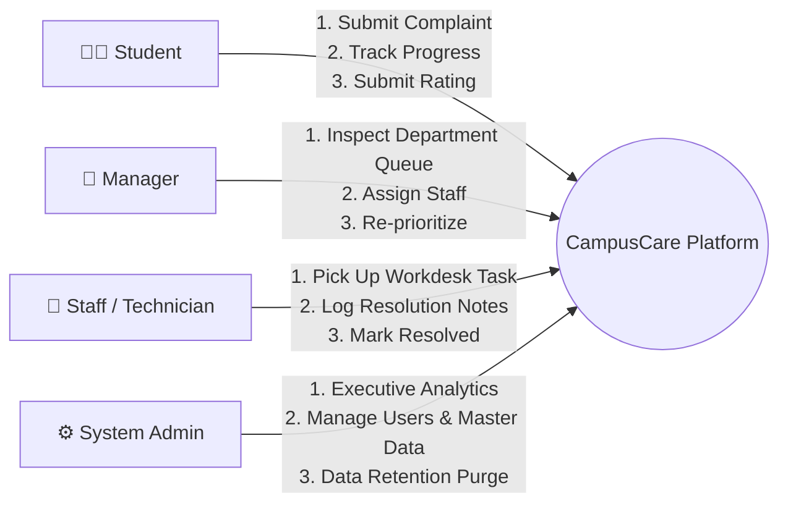

# CampusCare – User Manual & Role Operations Guide

This user manual outlines the end-to-end operational workflows for all four user roles in the **CampusCare** system: **Students**, **Staff / Technicians**, **Department Managers**, and **System Administrators**.

---

## 1. Persona & Role Overview

---

## 2. Default Login Credentials

| Role | Email Address | Password | Primary Scope |
| :--- | :--- | :--- | :--- |
| **Admin** | `admin@college.com` | `Password123!` | System-wide analytics & administrative control |
| **Manager** | `manager@college.com` | `Password123!` | IT Department management & staff allocation |
| **Staff (IT)** | `staff1@college.com` | `Password123!` | IT technical maintenance workdesk |
| **Staff (Maintenance)** | `staff2@college.com` | `Password123!` | Plumbing/Electrical/Facility workdesk |
| **Student 1** | `student1@college.com` | `Password123!` | Issue reporting & feedback submission |
| **Student 2** | `student2@college.com` | `Password123!` | Issue reporting & feedback submission |

---

## 3. Student Operations Manual

### 3.1 Registering an Account & Logging In
1. Navigate to `http://localhost:5000/Account/Register`.
2. Enter your **Full Name**, **College Email**, and a secure password (min 6 characters).
3. Upon registration, you are automatically assigned the `Student` role and redirected to the login page.
4. Log in using your email and password.

### 3.2 Filing a New Complaint
1. Click **"+ File Complaint"** in the top navigation bar or student dashboard.
2. Fill in the required fields:
   - **Complaint Title**: Short summary of the problem (e.g., *"Wi-Fi router down in Computer Lab 2"*).
   - **Location**: Specific block/room (e.g., *"CS Block, Room 204"*).
   - **Category**: Select the relevant category (e.g., `IT / Wi-Fi`, `Classroom`, `Maintenance`).
   - **Description**: Detailed explanation of the symptoms, urgency, or impact.
   - **Attachment (Optional)**: Upload an image/screenshot (PNG, JPG, PDF) demonstrating the issue.
3. Click **"Submit Complaint"**.
4. The system automatically:
   - Allocates a tracking code (e.g., `CMP-2026-00001`).
   - Runs AI Triage to infer priority and department routing.
   - Dispatches webhook notifications.

### 3.3 Tracking Status & Audit History
1. Navigate to **"My Complaints"** (`/Student`).
2. The dashboard displays counter cards:
   - **Total Filed**
   - **Pending / In Progress**
   - **Resolved**
   - **Escalated**
3. Click **"View Details"** on any ticket:
   - Review the complete chronological **Audit Trail** (Submission $\rightarrow$ Assignment $\rightarrow$ Work Started $\rightarrow$ Resolution).
   - View the AI Triage summary card.
   - Post comments in the discussion thread.

### 3.4 Rating & Closing a Resolved Complaint
1. Once staff resolves an issue, the ticket status changes to `Resolved`.
2. On the ticket details page:
   - Review the **Staff Resolution Notes**.
   - Select a star rating from **1 to 5 Stars**.
   - Enter optional satisfaction comments.
   - Click **"Confirm & Close Ticket"**.

---

## 4. Staff Workdesk Manual

### 4.1 Viewing Assigned Complaints
1. Log in with a Staff account (e.g., `staff1@college.com`).
2. The **Staff Workdesk** (`/Staff`) displays:
   - **Assigned Tasks**: Tickets currently assigned to you.
   - **In Progress Tasks**: Tickets you are actively resolving.
   - **Completed / Resolved**: Tickets you successfully closed.

### 4.2 Updating Ticket Workflow Status
1. Click **"Inspect & Update"** on any ticket assigned to you.
2. Under **"Workflow Actions"**:
   - Change status to **`InProgress`** when you begin investigating or repairing.
   - If blocked or requires escalation, flag as **`Escalated`**.
   - If invalid/duplicate, select **`Rejected`** and provide a reason.

### 4.3 Submitting Technical Resolution Notes
1. When work is completed:
   - Set status to **`Resolved`**.
   - Fill in **Resolution Details** (e.g., *"Replaced faulty RJ45 patch cable on port 12 and verified 100Mbps link"*).
   - Click **"Update Status & Log Fix"**.
2. The student is notified, and the SLA clock stops.

---

## 5. Department Manager Manual

### 5.1 Monitoring Department Workload
1. Log in with a Manager account (e.g., `manager@college.com`).
2. The **Manager Console** (`/Manager`) presents:
   - **Unassigned Queue**: Newly submitted complaints awaiting staff allocation.
   - **Department Active Tickets**: Real-time listing across all staff.
   - **Staff Workload Table**: Number of active and completed tickets per staff technician.

### 5.2 Assigning Complaints to Technicians
1. In the Unassigned queue, click **"Assign Staff"** (`/Manager/Assign/{id}`).
2. Select a technician from your department from the dropdown.
3. Optionally adjust the **Priority Level** (e.g., bump to `High` or `Critical`) or re-categorize if needed.
4. Click **"Confirm Assignment"**.
5. The staff member is immediately assigned, and the ticket enters `Assigned` status.

---

## 6. System Administrator Manual

### 6.1 Executive Analytics Dashboard
1. Log in with an Admin account (`admin@college.com`).
2. The **Admin Console** (`/Admin`) provides high-level KPIs:
   - **Total System Complaints**
   - **Overall Resolution Rate (%)**
   - **Average Resolution Time (in Hours)**
   - **Average Student Satisfaction Rating (out of 5.0★)**
   - **Department-wise Workload Distribution**

### 6.2 User Directory Management
1. Navigate to **"User Directory"** (`/Admin/Users`).
2. View all registered accounts across all roles.
3. Click **"Create Staff / Manager"** to provision new departmental staff.
4. Toggle user status between **Active** and **Deactivated** with a single click.

### 6.3 Master Data Configuration
- **Departments** (`/Admin/Departments`): Create, edit, or view departments and their short codes.
- **Complaint Categories** (`/Admin/Categories`): Configure issue categories and map default responsible departments.

### 6.4 Data Retention & Bulk Purge
1. Under **"Data Retention & Purge"** on the Admin Console:
2. Select a retention window:
   - Purge Closed complaints older than **7 Days**, **30 Days**, **90 Days**, or **All Closed (0 Days)**.
3. Click **"Execute Purge"** (requires confirmation).
4. Cleans up legacy closed records and attachments to maintain optimal database performance.
